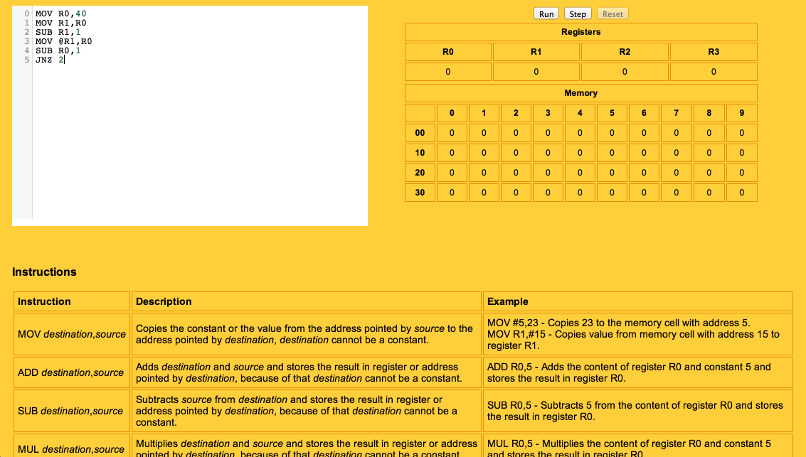
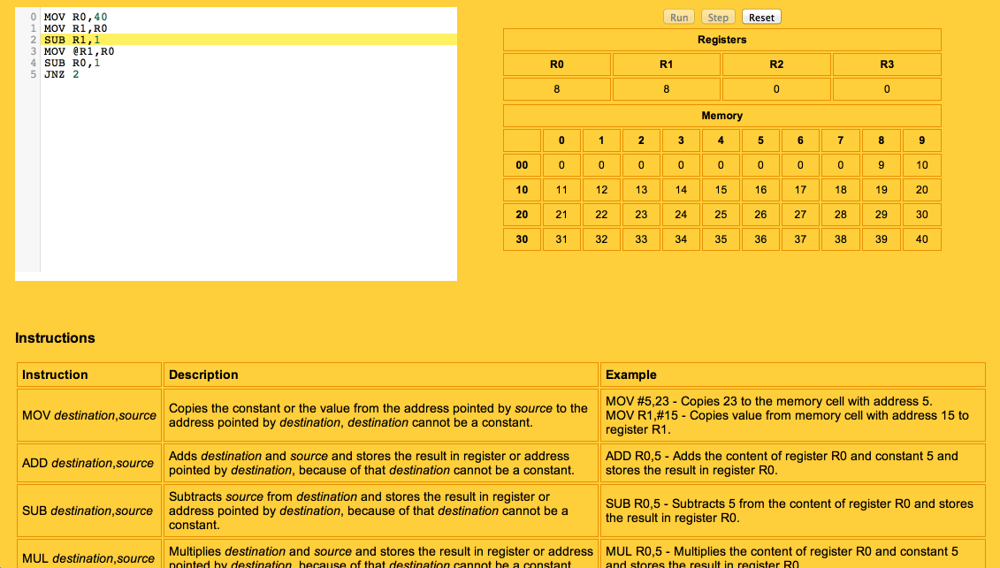
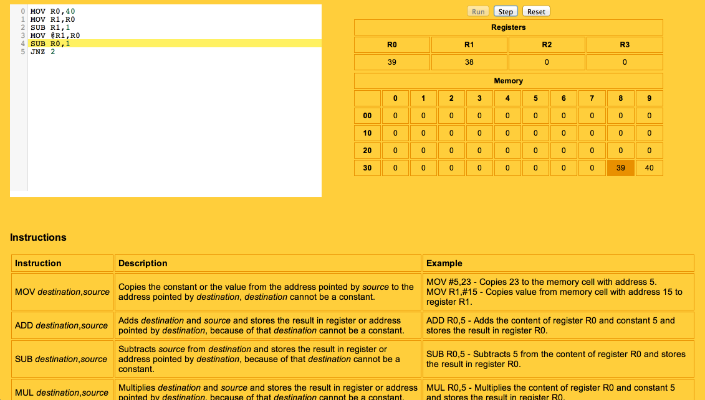

jsasm
=====

### How to run

Simple educational tool for learning assembly language.
To run the app and see more instructions simply open src/index.html :).
You can also use [**htmlpreview**](http://htmlpreview.github.io/?https://github.com/sulewicz/jsasm/blob/master/src/index.html) to run it without cloning the repository.

### Screenshots

