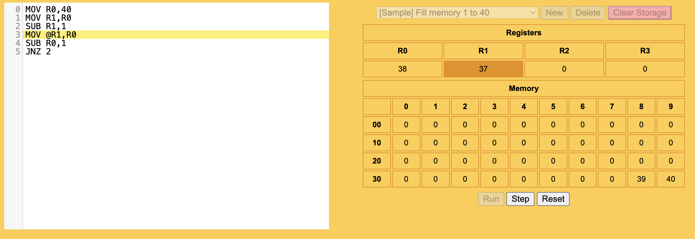

jsasm
=====

### How to run

Simple educational tool for learning assembly language.
To run the app and see more instructions run `yarn install && yarn start`.
You can also access [JSAsm](https://jsasm.coderoller.org) page to run it without cloning the repository.

